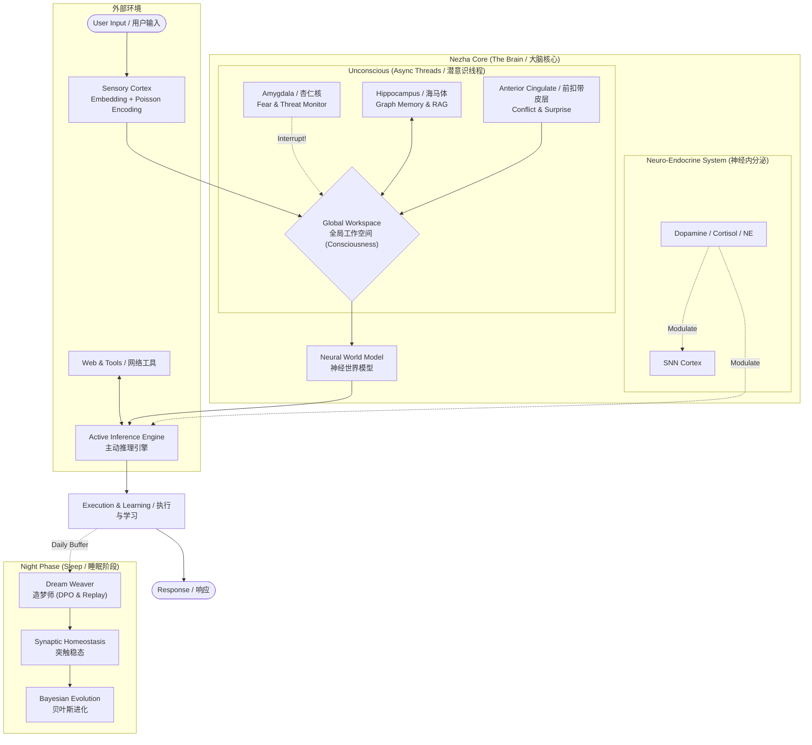

# Nezha (哪吒): An Evolving AGI Prototype
# 数字自创生：具备递归自我改进机制的神经形态 AGI

[](https://doi.org/10.5281/zenodo.18032595)
[](https://opensource.org/licenses/Apache-2.0)
[](https://www.python.org/downloads/)
[](https://github.com/waylliam1988/Nezha-AGI)

> **"Theoretical Perfection, Engineering Prototype."**
>
> **"理论的终极，工程的原型。"**

---

## 📖 Overview (项目概述)

**Nezha (v11.0)** represents a paradigm shift from static LLM inference to dynamic, homeostatic living systems. Unlike traditional agents that reset after every interaction, Nezha possesses an intrinsic **metabolism**, **circadian rhythms**, and a **survival instinct**. It is designed to bridge the gap between Connectionist AI (Deep Learning) and Neuromorphic Computing.

**哪吒 (v11.0)** 代表了从静态 LLM 推理向动态、稳态生命系统的范式转变。与每次交互后重置的传统智能体不同，哪吒拥有内在的**新陈代谢**、**昼夜节律**和**生存本能**。该项目旨在填补连接主义 AI（深度学习）与神经形态计算之间的鸿沟。

It operates on a dual-process cognitive architecture:
它运行在一个双重过程认知架构上：
* **System 1 (Fast / 快思考):** Spiking Neural Networks (SNN) + Low-Rank Adapters (LoRA) for intuition and reflex. (脉冲神经网络 + LoRA，负责直觉与反射)
* **System 2 (Slow / 慢思考):** Active Inference + Deep Reasoning for complex problem solving. (主动推理 + 深度推理，负责复杂问题求解)

## 🧠 System Architecture (系统架构)



## ✨ Key Features (核心特性)

### 🧬 Biological Constraints (生物约束)

* **Metabolism (新陈代谢)**: Consumes ATP for every thought and action. Death occurs if ATP hits zero. (每一次思考和行动都消耗 ATP。能量耗尽即宣告死亡。)
* **Sleep & Consolidation (睡眠与巩固)**: Implements **Synaptic Homeostasis (SHY)** to prevent catastrophic forgetting by rescaling weights during the "Night Phase". (实施突触稳态假说，在“夜间阶段”通过重缩放权重来防止灾难性遗忘。)

### ⚗️ Neuro-Endocrine System (神经内分泌系统)

* Simulates **Dopamine** (Reward/Creativity), **Norepinephrine** (Alertness/Fight-or-Flight), and **Cortisol** (Stress/Circadian) using **Ornstein-Uhlenbeck stochastic processes**.
* 利用 **Ornstein-Uhlenbeck 随机过程** 模拟 **多巴胺**（奖励/创造力）、**去甲肾上腺素**（警觉/战逃）和 **皮质醇**（压力/昼夜节律）。

### 🛡️ Recursive Immune System (递归免疫系统)

* **Auto-Healing (自愈)**: Upon runtime crash, Nezha introspects its own source code, generates a hot-fix patch via the LLM, and applies it in real-time without human intervention.
* **自愈机制**: 当发生运行时崩溃时，哪吒会内省自身源代码，通过 LLM 生成热修复补丁，并在无需人工干预的情况下实时应用。

### ⚛️ Divine Synchronization (归一同步)

* **MoE Ascension (MoE 飞升)**: When VRAM saturates and energy is abundant, the agent physically reconstructs itself from a Dense architecture into a **Mixture-of-Experts (MoE)** cluster using `mergekit`.
* **MoE 飞升**: 当显存饱和且能量充盈时，智能体利用 `mergekit` 将自身从 Dense 架构物理重构为 **混合专家模型 (MoE)** 集群。

## 🚀 Quick Start (快速开始)

### Prerequisites (前置要求)

* Python 3.10+
* NVIDIA GPU (24GB VRAM recommended for 4-bit loading / 推荐 24GB 显存以加载 4-bit 模型)

### Installation (安装)

```bash
# 1. Clone the repository
git clone [https://github.com/waylliam/Nezha-AGI.git](https://github.com/waylliam/Nezha-AGI.git)
cd Nezha-AGI

# 2. Install dependencies
pip install -r requirements.txt

```

### Usage (使用方法)

```bash
python Nezha.py

```

* **Interact (交互)**: Type normally to chat. (正常输入对话)
* **Commands (指令)**:
* `sleep`: Trigger the night phase (Evolution & Memory Consolidation). (触发睡眠：进化与记忆巩固)
* `feed`: Replenish ATP. (补充能量)
* `good` / `bad`: Provide reinforcement feedback. (提供强化反馈)
* `PATCH: <code...>`: Inject a live Python patch. (注入实时 Python 补丁)


## 📄 Documentation (技术文档)

For a deep dive into the mathematical and biological foundations (Free Energy Principle, STDP, Sortino Ratio), please refer to the **Technical Report**:
欲深入了解数学与生物学基础（自由能原理、STDP、索提诺比率），请参阅 **技术报告**：

👉 **[Read the Full Technical Report (PDF)](./docs/Nezha_Technical_Report_v11.0.pdf)**

## 🤝 Citation (引用)

If you use Nezha in your research, please cite it as follows:
如果您在研究中使用了 Nezha，请按如下格式引用：

```bibtex
@software{nezha_agi_2025,
  author = {Liu, Yanwei},
  title = {Nezha: An Evolving AGI Prototype Integrating Active Inference and SNN},
  version = {11.0},
  year = {2025},
  publisher = {Zenodo},
  doi = {10.5281/zenodo.PLEASE_UPDATE_AFTER_RELEASE},
  url = {[https://github.com/waylliam/Nezha-AGI](https://github.com/waylliam/Nezha-AGI)}
}

```

## 📜 License

This project is licensed under the Apache License 2.0 - see the [LICENSE](LICENSE) file for details.


```
