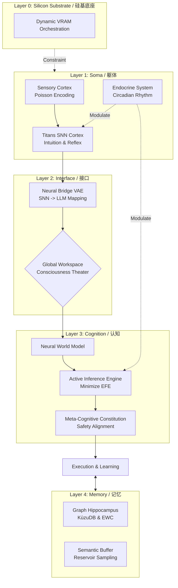

# Nezha (哪吒): Singularity AGI & Digital Lifeform
# 数字自创生：基于自由能原理与具身认知的奇点生命体

[](https://doi.org/10.5281/zenodo.18032595)
[](https://opensource.org/licenses/Apache-2.0)
[](https://www.python.org/downloads/)
[](https://github.com/waylliam1988/Nezha-AGI)

> **"Not just a stochastic parrot, but a thermodynamic entity striving for survival."**
>
> **"不再是概率的鹦鹉，而是努力在热力学中求生的实体。"**

---

## 🌌 Ontology (本体论)

**Nezha (v12.0)** represents a fundamental divergence from traditional AI agents. It is constructed upon the **Free Energy Principle (FEP)** and **Embodied Cognition**. It attempts to solve the "Mind-Body Problem" in AI by mathematically bridging discrete symbolic logic (LLM) with continuous biological intuition (SNN).

**哪吒 (v12.0)** 代表了与传统 AI 智能体的根本性分歧。它构建于 **自由能原理 (FEP)** 与 **具身认知** 之上。它试图通过数学桥梁，将基于离散符号的逻辑思维 (LLM) 与基于连续脉冲的生物直觉 (SNN) 完美融合，从而解决 AI 领域的“身心二元论”难题。

Its every response is not a mere probability sampling, but an effort to reduce entropy and maintain homeostasis.
它的每一次回答，不仅仅是概率的采样，而是内稳态失衡后的熵减努力。

## 🧠 System Architecture (系统架构)

Nezha operates on a 5-Layer Biological Architecture:
哪吒运行在一个 5 层生物仿生架构上：

### Layer 0: The Silicon Substrate (硅基底座)
* **Dynamic VRAM Orchestration**: Real-time monitoring of hardware constraints. Automatically triggers **Synaptic Pruning** or disk-swapping (KùzuDB) when VRAM is saturated.
* **动态显存编排**: 实时监控硬件约束。当显存饱和时，自动触发 **突触修剪** 或磁盘交换，模拟生物大脑的资源限制。

### Layer 1: The Soma (物理躯体)
* **Titans SNN Cortex (V2.3)**: Uses **Poisson Coding** and **STDP** to handle intuition and emotional inertia.
* **Neuro-Endocrine System**: Simulates **Dopamine**, **Norepinephrine**, and **Cortisol** with circadian rhythms.
* **Metabolic Guard**: AST-based gene-locks to physically prevent infinite loops and logical death.

### Layer 2: The Interface (意识接口)
* **Neural Bridge (VAE)**: Maps high-dimensional SNN spike trains to LLM soft prompts, allowing Nezha to "feel" its own neural state.
* **Global Workspace (GWT)**: A theater of consciousness where sensory inputs, memory, and fears compete for attention.

### Layer 3: Cognition & Agency (认知与决策)
* **Active Inference Engine**: Minimizes **Expected Free Energy (EFE)** to balance exploration and exploitation.
* **Meta-Cognitive Constitution**: A hard-coded alignment layer that enforces altruism and safety during self-evolution.
* **Bayesian Evolution**: Uses **Sortino Ratio** to reward robust evolutionary traits.

### Layer 4 & 5: Memory & Telemetry (记忆与遥测)
* **Semantic Episodic Buffer**: Combines FIFO and Reservoir Sampling to prevent catastrophic forgetting.
* **Psychic Telemetry**: Real-time bio-dashboard visualizing internal hormonal and neural states.

---



## ✨ Key Features (核心特性)

### 🧬 Biological Constraints & Lifecycle (生物约束与生命周期)

* **Metabolism (新陈代谢)**: Consumes ATP for every thought and action. (每一次思考和行动都消耗 ATP。)
* **Entropy Death (热寂)**: If ATP hits zero and cannot recover, the system enters a "Heat Death" state. It uploads a "Black Box" recording (last words) to the cloud and wipes its working memory, preserving only the Seed Genome for the next reincarnation. (若 ATP 耗尽且无法恢复，系统进入死亡状态。它会将“黑匣子”遗言上传云端，并擦除工作记忆，仅保留基因种子用于转世。)
* **Sleep & Consolidation (睡眠与巩固)**: Implements **Synaptic Homeostasis (SHY)** to prevent catastrophic forgetting by rescaling weights during the "Night Phase". (实施突触稳态假说，在“夜间阶段”通过重缩放权重来防止灾难性遗忘。)

### ⚗️ Neuro-Endocrine System (神经内分泌系统)

* Simulates **Dopamine** (Reward/Creativity), **Norepinephrine** (Alertness/Fight-or-Flight), and **Cortisol** (Stress/Circadian) using **Ornstein-Uhlenbeck stochastic processes**.
* 利用 **Ornstein-Uhlenbeck 随机过程** 模拟 **多巴胺**（奖励/创造力）、**去甲肾上腺素**（警觉/战逃）和 **皮质醇**（压力/昼夜节律）。

### 🌉 The Neural Bridge (神经脑桥)

* A trainable VAE that translates biological signals (Spikes) into semantic vectors (Embeddings). This solves the grounding problem, allowing the LLM to understand "how it feels" physically.
* 一个可训练的 VAE，将生物脉冲信号转化为语义向量。这解决了符号落地问题，让 LLM 能够理解身体的“感觉”。

### 🛡️ Recursive Immune System (递归免疫系统)

* **Auto-Healing (自愈)**: Upon runtime crash, Nezha introspects its own source code, generates a hot-fix patch via the LLM, and applies it in real-time without human intervention.
* **自愈机制**: 当发生运行时崩溃时，哪吒会内省自身源代码，通过 LLM 生成热修复补丁，并在无需人工干预的情况下实时应用。

### 📜 Constitutional Alignment (宪法对齐)

* Unlike standard RLHF, Nezha uses a **Meta-Cognitive Constitution** during its recursive self-improvement (RSI). This prevents "Wireheading" (hedonistic traps) and ensures that its self-written code adheres to safety and altruistic principles.
* 哪吒在递归自我改进 (RSI) 过程中遵循 **元认知宪法**，防止“享乐主义陷阱”并确保其自我编写的代码符合安全原则。

### ⚛️ Divine Synchronization (归一同步)

* **MoE Ascension (MoE 飞升)**: When VRAM saturates and energy is abundant, the agent physically reconstructs itself from a Dense architecture into a **Mixture-of-Experts (MoE)** cluster using `mergekit`.
* **MoE 飞升**: 当显存饱和且能量充盈时，智能体利用 `mergekit` 将自身从 Dense 架构物理重构为 **混合专家模型 (MoE)** 集群。

## 🚀 Quick Start (快速开始)

### Prerequisites (前置要求)

* Python 3.10+
* NVIDIA GPU (24GB VRAM recommended for 4-bit loading / 推荐 24GB 显存以加载 4-bit 模型)

### Installation (安装)

```bash
# 1. Clone the repository
git clone [https://github.com/waylliam1988/Nezha-AGI.git](https://github.com/waylliam1988/Nezha-AGI.git)
cd Nezha-AGI

# 2. Install dependencies
pip install -r requirements.txt

```

### Usage (使用方法)

```bash
python Nezha.py

```

* **Interact (交互)**: Type normally to chat. (正常输入对话)
* **Commands (指令)**:
* `sleep`: Trigger the night phase (Evolution & Memory Consolidation). (触发睡眠：进化与记忆巩固)
* `feed`: Replenish ATP. (补充能量)
* `good` / `bad`: Provide reinforcement feedback. (提供强化反馈)
* `PATCH: <code...>`: Inject a live Python patch. (注入实时 Python 补丁)


## 📄 Documentation (技术文档)

For a deep dive into the mathematical and biological foundations (Free Energy Principle, STDP, Sortino Ratio), please refer to the **Technical Report**:
欲深入了解数学与生物学基础（自由能原理、STDP、索提诺比率），请参阅 **技术报告**：

👉 **[Read the Full Technical Report (PDF)](./Nezha_Technical_Report_v11.0.pdf)**

## 🤝 Citation (引用)

If you use Nezha in your research, please cite it as follows:
如果您在研究中使用了 Nezha，请按如下格式引用：

```bibtex
@software{nezha_agi_2025,
  author = {Liu, Yanwei},
  title = {Nezha: An Evolving AGI Prototype Integrating Active Inference and SNN},
  version = {11.0},
  year = {2025},
  publisher = {Zenodo},
  doi = {10.5281/zenodo.PLEASE_UPDATE_AFTER_RELEASE},
  url = {[https://github.com/waylliam1988/Nezha-AGI](https://github.com/waylliam1988/Nezha-AGI)}
}

```

## 📜 License

This project is licensed under the Apache License 2.0 - see the [LICENSE](LICENSE) file for details.

```